# 🍑 Peachy Plates Recipe Hub  (Figma - UI Design)

**Mobile Application Development (MAD) Project | 2nd Year, 2nd Semester**  

---

## 📖 Overview
Designed a **clean, modern, and intuitive** user interface for **Peachy Plates**, a mobile recipe application, using **Figma**.  
The design focuses on enhancing user experience with **visually engaging layouts**, **easy-to-navigate screens**, and a **cohesive design system** tailored for food lovers and home cooks.

---

## ✨ Key Design Highlights
- 🍽 **Minimalistic & aesthetic UI** with a warm, appetizing color palette  
- 📱 **Smooth navigation flow** for browsing, saving, and viewing recipes  
- 📝 **Thoughtfully crafted screens** for recipe discovery, ingredients, and step-by-step instructions  
- 📐 **Mobile-first approach** with responsive design principles

---

## 🎨 Design Preview
**Figma Prototype:** [View on Figma](https://www.figma.com/design/CIiz6Y4z6ZBFEwwB0RprCm/recipe-app?node-id=0-1&t=bbAeYX2ROBNZio5o-1)

**Design Files:** See [`Designs`](designs/) folder in this repository.  

### 📷 UI Screens

| Logo screen| Onboarding screen1 | Onboarding screen2 |Onboarding screen3 | Home Screen | Recipe Details |
|-------------|----------------|---------------|---------------|---------------|---------------|
| 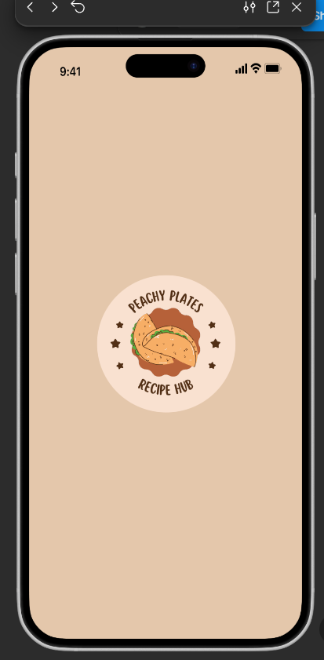 | 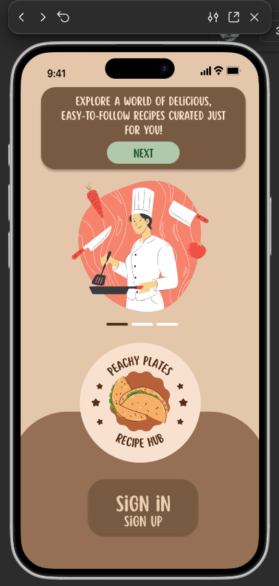 | 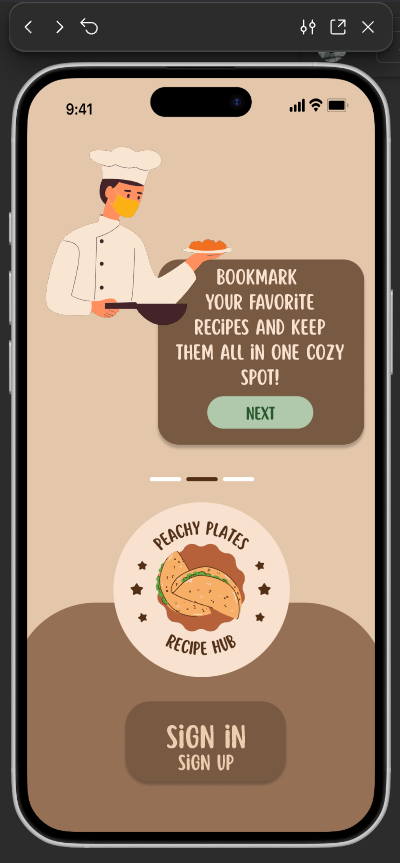 | 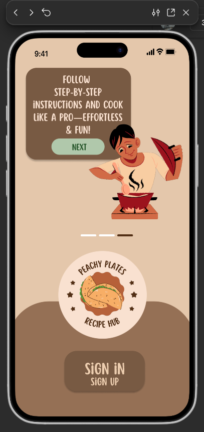 | 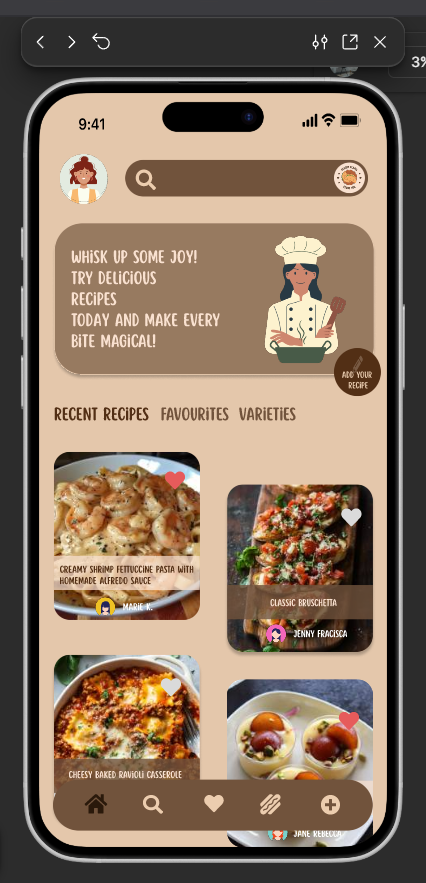 | 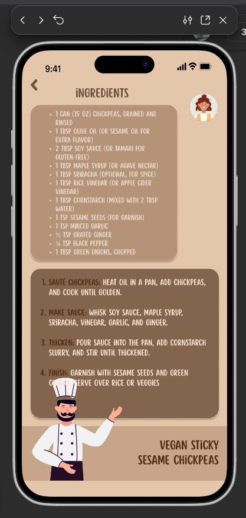 |

| Sign in/Sign up screen| SugnIn screen | ForgetPassword screen | Verification Screen | Profile Screen1 | Profile Screen2 | 
|-------------|----------------|---------------|---------------|---------------|---------------|
| 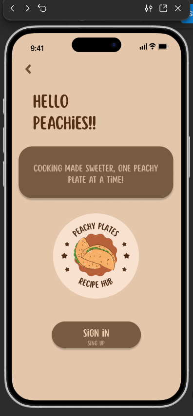 | 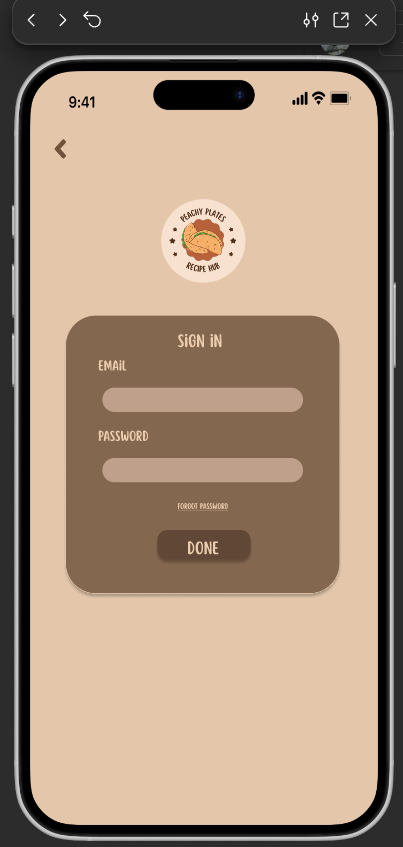 | 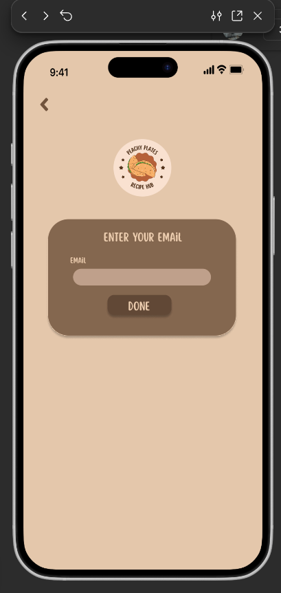 | 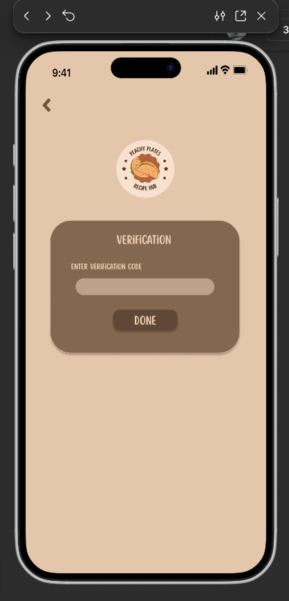 | 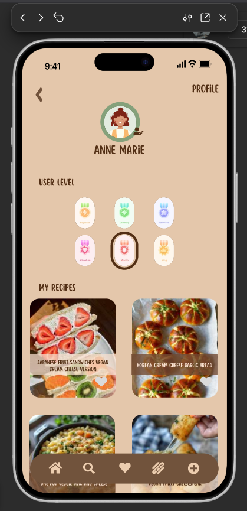 | 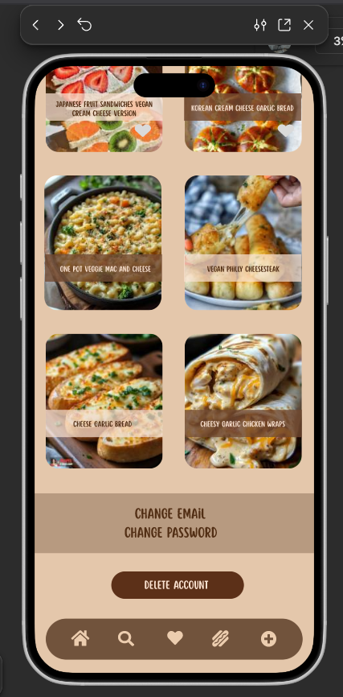 |

| Search screen1| Favourites screen | varieties screen | Add Recipe Screen1 | Add Recipe Screen2 | 
|-------------|----------------|---------------|---------------|---------------|
| 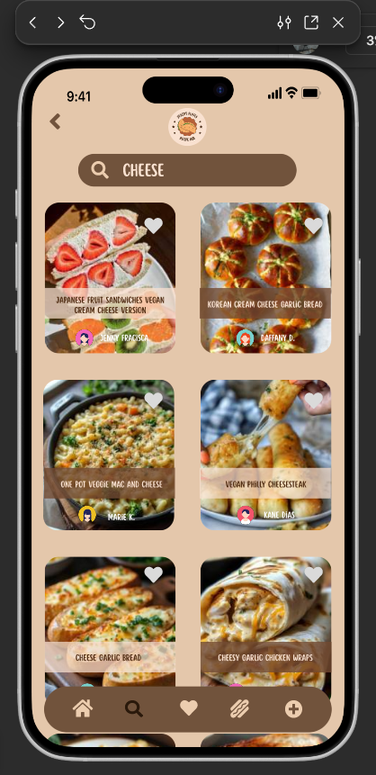 | 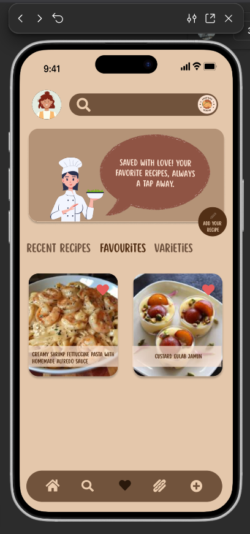 | 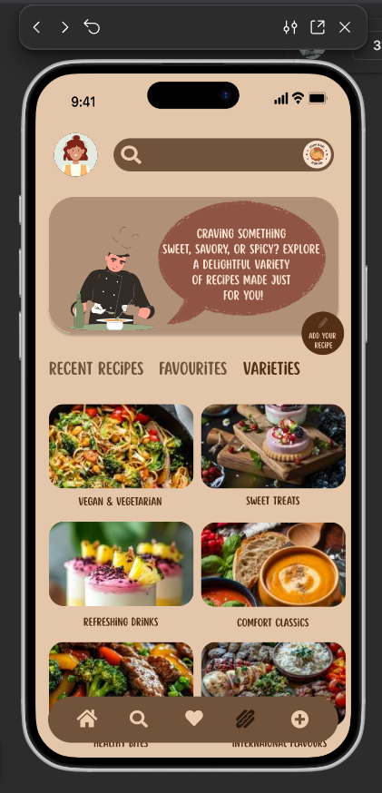 |  | 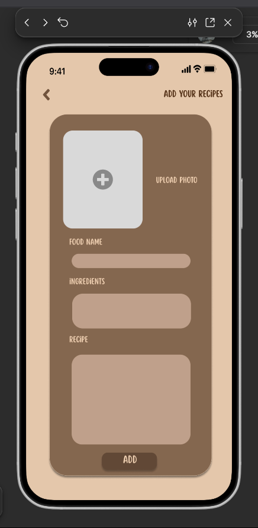 |

---

## 🛠 Skills & Tools
- **Figma** (UI/UX Design)
- **User Interface Design**
- **Canva** (for supporting visuals)

---

## 📂 Repository Contents
- `/designs` → All Figma exports    
- `README.md` → Project overview  

---

## 📜 License
Designs: CC BY-NC 4.0 License  
